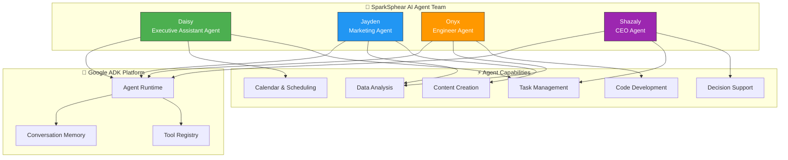

# 🤖 SparkSphear AI Agents — Google ADK Agent Team

> **A team of autonomous AI agents built with Google Agent Development Kit (ADK)**  
> Daisy, Jayden, Onyx, and Shazaly — working together to run SparkSphear Tech.

---

## 🧠 AI Agent Team Architecture



## 🤖 AI Agents

| Agent | Role | Function |
|-------|------|----------|
| **Daisy** | Executive Assistant | Task management, calendar, scheduling, admin support |
| **Jayden** | Marketing Agent | Content creation, social media, analytics, SEO |
| **Onyx** | Engineer Agent | Code development, automation, technical build-out |
| **Shazaly** | CEO Agent | Strategic decisions, oversight, coordination |

## 🛠 Tech Stack

| Component | Technology | Agent Role |
|-----------|-----------|------------|
| **Agent Framework** | Google ADK | Agent orchestration & tool use |
| **Runtime** | Python 3.11+ | Agent execution environment |
| **Voice** | `run_voice.py` | Voice interface for agent interaction |
| **Authentication** | `credentials.json` + `token.json` | OAuth for Google services |

## ⚡ Quick Start

```bash
# Install dependencies
pip install -r requirements.txt

# Run the voice-enabled agent team
python run_voice.py
```

---

Built by **[Shazaly Musa](https://github.com/SparkSpheartech)** — Founder, SparkSphear Tech  
*AI Agents for Business Operations (Powered by Google ADK)*